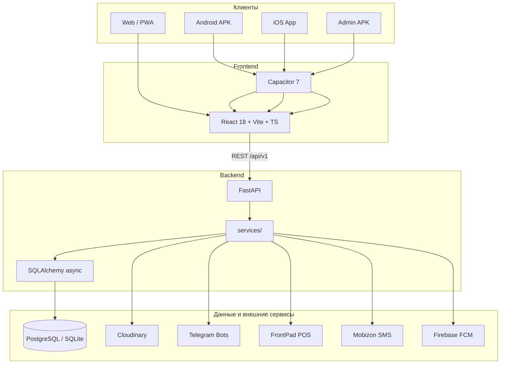
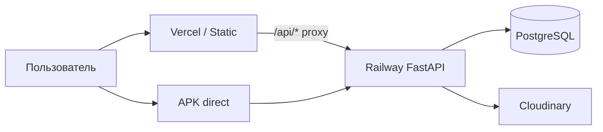

# Архитектура Sortirovka24

---

## Общая схема



---

## Технологический стек

| Слой | Технологии |
|------|------------|
| **UI** | React 18, TypeScript, Vite, Tailwind CSS, shadcn/ui, Lucide Icons |
| **i18n** | `LanguageContext`, переводы RU/KZ |
| **Мобильность** | Capacitor 7 (Android/iOS), PWA manifest |
| **API-клиент** | `@metagptx/web-sdk`, обёртки в `lib/api.ts` |
| **Backend** | Python 3, FastAPI, Uvicorn |
| **ORM / миграции** | SQLAlchemy 2 (async), Alembic |
| **БД (прод)** | PostgreSQL + asyncpg |
| **БД (dev)** | SQLite + aiosqlite |
| **Auth** | JWT (жители + админ), bcrypt, Google OAuth |
| **Файлы** | Cloudinary |
| **E2E** | Playwright |

---

## Структура репозитория

```
sortirovka24/
├── docs/                          # Документация проекта (этот каталог)
├── README.md                      # Быстрый старт
├── PRODUCTION_CHECKLIST.md        # Чеклист продакшена
├── Dockerfile                     # Контейнер бэкенда
├── app/
│   ├── backend/                   # FastAPI API
│   │   ├── main.py                # Точка входа, lifespan, роутеры
│   │   ├── lambda_handler.py      # AWS Lambda (альтернатива Railway)
│   │   ├── core/                  # config, database, auth
│   │   ├── models/                # SQLAlchemy модели
│   │   ├── routers/               # HTTP endpoints (/api/v1/...)
│   │   ├── services/              # Бизнес-логика
│   │   ├── schemas/               # Pydantic-схемы
│   │   ├── alembic/               # Миграции БД
│   │   ├── mock_data/             # Seed для dev
│   │   ├── middleware/            # SDK compat, entity guard
│   │   └── tests/
│   ├── frontend/                  # Основное приложение жителей
│   │   ├── src/
│   │   │   ├── App.tsx            # Маршрутизация
│   │   │   ├── pages/             # Страницы модулей
│   │   │   ├── components/        # UI-компоненты
│   │   │   ├── lib/               # API, cache, storage
│   │   │   ├── config/modules.ts  # Список модулей (sync с backend)
│   │   │   └── contexts/          # Theme, Language
│   │   ├── android/ ios/          # Capacitor native projects
│   │   ├── releases/              # APK / AAB артефакты
│   │   └── public/                # PWA, legal HTML
│   ├── admin-panel/               # Отдельное Admin APK
│   └── admin-app/                 # Legacy обёртка (→ admin-panel)
└── start_app_v2.sh                # Скрипт запуска (Linux)
```

---

## Backend: слои

### 1. `main.py`
- Загрузка `.env`, CORS, статика (privacy, terms)
- Lifespan: инициализация БД, seed, admin, buckets, FrontPad
- Автоподключение роутеров из `routers/`
- Health: `/health`, `/api/v1/health-check`

### 2. `routers/`
Тонкий HTTP-слой: валидация, зависимости (`get_db`, `require_module`), вызов service.

Примеры префиксов:
- `/api/v1/account/*` — регистрация, профиль, JWT жителя
- `/api/v1/admin-auth/*` — вход в админку
- `/api/v1/modules` — флаги включения модулей
- `/api/v1/food-*`, `/api/v1/gastronom-*` — коммерция
- `/api/v1/taxi/*` — такси
- `/api/v1/telegram/webhook` — inline-кнопки заказов

### 3. `services/`
Вся бизнес-логика: заказы, синхронизация меню, SMS, push, module guard.

### 4. `models/`
Таблицы: контент (news, announcements), food, account_system, logistics, module_settings и др.

### 5. Middleware
- **sdk_compat** — совместимость с envelope формата Atoms/web-sdk
- **entity_guard** — проверки доступа к сущностям

---

## Frontend: слои

### Маршрутизация (`App.tsx`)
- Eager: главная `/`
- Lazy: все остальные страницы + `Suspense` + skeleton
- `ModuleRoute` — редирект home если модуль выключен
- `RequireUserAuth`, `RequireCabinetRole`, `RequireCourierAccess` — guards

### Состояние и данные
- JWT жителя: localStorage (`accountApi`)
- JWT админа: `_sp924_token`
- Кэш запросов: `lib/cache.ts`, prefetch: `lib/prefetch.ts`
- Модули: hook `useModules()` → GET `/api/v1/modules`

### Сборки
| Команда | Результат |
|---------|-----------|
| `pnpm run dev` | Dev server :3000, proxy `/api` → :8000 |
| `pnpm run build` | `dist/` для веб |
| `pnpm run build:mobile` | Production + `.env.mobile` |
| `pnpm run build:admin` | `dist-admin/` только админка |
| `pnpm run cap:sync` | Web → native projects |

---

## Деплой (типовая конфигурация)



- **Frontend:** статика `dist/` на Vercel; `vercel.json` проксирует API на Railway
- **Backend:** Railway container, `PORT`, `DATABASE_URL`, secrets из `.env.example`
- **Mobile:** APK/AAB с `VITE_API_BASE_URL` на абсолютный URL Railway
- **Альтернатива:** AWS Lambda через `lambda_handler.py`

---

## Интеграции

| Сервис | Назначение | Env-переменные |
|--------|------------|----------------|
| **Cloudinary** | Фото/видео пользователей и контента | `CLOUDINARY_*` |
| **Mobizon** | SMS-коды регистрации | `MOBIZON_API_KEY`, `SMS_PROVIDER` |
| **Google OAuth** | Вход через Google | `GOOGLE_CLIENT_ID`, `GOOGLE_CLIENT_SECRET` |
| **Telegram** | Уведомления операторам, курьерам, такси | `TELEGRAM_BOT_TOKEN_*`, `TELEGRAM_CHAT_ID_*` |
| **FrontPad** | Касса DAM ALEM: меню и заказы | `FRONTPAD_*` |
| **Stripe** | Онлайн-оплата (опционально) | `STRIPE_*` |
| **FCM** | Push на Android/iOS | `FCM_SERVER_KEY`, `google-services.json` |
| **OpenAI** | AI Hub модуль (опционально) | `OPENAI_API_KEY` |

---

## Потоки данных (ключевые)

### Регистрация жителя
1. POST SMS-код → Mobizon  
2. POST verify → создание `AccountUser`, JWT, бонус  
3. Frontend сохраняет token → доступ к `/cabinet`

### Заказ DAM ALEM
1. Корзина → POST food order  
2. Telegram оператору + optional FrontPad `new_order`  
3. Курьер видит заказ в `/food/courier` или Telegram courier chat  
4. Трекинг: `/delivery/food/:orderId`

### Отключение модуля
1. Admin → PATCH modules → `module_settings` в БД  
2. Frontend скрывает UI; API возвращает 404 на роуты модуля  
3. Админ с JWT panel всё ещё может управлять контентом

---

## База данных

- **Миграции:** `alembic upgrade head` на проде при деплое
- **Seed:** `mock_data/` при первом старте (dev/demo)
- **Специальные seed:** `dam_alem_catalog_seed`, `prorab_seed`

Основные группы таблиц:
- Контент: news, announcements, complaints, jobs, questions, directory, banners, categories
- Food: food_items, food_orders, food_restaurants, park_points, park_orders, couriers
- Account: account_users, bonuses, favorites, master/driver/partner profiles
- System: module_settings, feature_toggles, frontpad_settings, admin credentials

---

## Безопасность архитектуры

- CORS настроен в FastAPI
- Rate limit на SMS (`utils/rate_limit.py`)
- Brute-force protection на admin login
- Секреты только в env бэкенда
- Blocklist fake admin paths (`/wp-admin`, `/dashboard` → redirect home)

Подробнее: [Роли и безопасность](./05-РОЛИ-И-БЕЗОПАСНОСТЬ.md)

---

## Масштабирование

- Stateless API → горизонтальное масштабирование на Railway
- Lazy DB init при cold start Lambda
- CDN Cloudinary для медиа
- Frontend code-splitting по страницам

---

## Связанные документы

- [Модули](./04-МОДУЛИ.md)
- [Разработка](./06-РАЗРАБОТКА.md)
- [Деплой](./07-ДЕПЛОЙ-И-ЭКСПЛУАТАЦИЯ.md)
