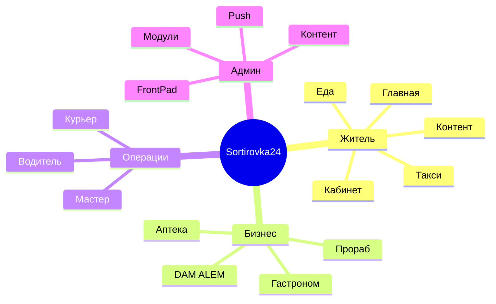

# Модули приложения Sortirovka24

Полный справочник функциональных блоков: что делает модуль, маршруты, API, админка.

---

## Управление модулями

17 модулей переключаются в **Админ → Система → Модули** (`AdminModules`).

| Slug | Название | Маршруты |
|------|----------|----------|
| `food` | Еда / доставка | `/food/*` |
| `gastronom` | Гастроном | `/gastronom` |
| `prorab` | Прораб (стройка) | `/prorab` |
| `pharmacy` | Аптека | `/apteka`, `/pharmacy` |
| `masters` | Мастера | `/masters/*` |
| `salons` | Салоны красоты | `/salons/*` |
| `inspectors` | Участковые | `/inspectors` |
| `real_estate` | Недвижимость | `/real-estate/*` |
| `announcements` | Объявления | `/announcements/*`, `/ads` |
| `jobs` | Вакансии | `/jobs/*` |
| `directory` | Справочник | `/directory` |
| `transport` | Транспорт | `/transport` |
| `questions` | Вопросы и ответы | `/questions/*` |
| `complaints` | Жалобы | `/complaints/*` |
| `news` | Новости | `/news/*` |
| `business` | Для бизнеса | `/business` |
| `history` | История района | `/history` |

**Не в общем переключателе:** такси (`/taxi`), поддержка проекта (`/support`) — отдельные настройки.

Источник правды:
- Backend: `app/backend/services/module_settings.py`
- Frontend: `app/frontend/src/config/modules.ts`

---

## Модули для жителей

### 🏠 Главная (`/`)
- Hero, плитки модулей, погода (OpenWeather через `/api/v1/weather`)
- Баннеры, быстрые действия, prefetch следующих экранов
- Скрывает плитки выключенных модулей

### 📰 Новости (`news`)
- Лента и детальная страница
- YouTube-embed в статьях
- Push при публикации (`published=true`)
- **Админ:** `AdminNews`

### 📢 Объявления (`announcements`)
- Пользовательские объявления (продажа, услуги)
- Создание требует авторизации
- **Админ:** `AdminAnnouncements`

### 🏢 Недвижимость (`real_estate`)
- Аренда и продажа жилья в районе
- **Админ:** `AdminRealEstate`

### 💼 Вакансии (`jobs`)
- Местные вакансии
- **Админ:** `AdminJobs`

### ❓ Вопросы (`questions`)
- Форум жителей: вопрос → ответы
- **Админ:** через контент-модерацию

### 📋 Жалобы (`complaints`)
- Жалобы ЖКХ с фото/видео
- Статусы обработки
- **Админ:** `AdminComplaints`

### 📖 Справочник (`directory`)
- Телефоны служб, организаций, полезные контакты
- **Админ:** `AdminDirectory`

### 🔧 Мастера (`masters`)
- Каталог специалистов, профили, заявки
- «Стать мастером» → модерация
- Кабинет мастера: `/cabinet/master`
- **Админ:** `AdminMasters`

### 💇 Салоны (`salons`)
- Каталог салонов красоты
- **Админ:** `AdminSalons`

### 👮 Участковые (`inspectors`)
- Карта и список участковых инспекторов
- **Админ:** `AdminInspectors`

### 🚌 Транспорт (`transport`)
- Маршруты автобусов, остановки
- Уведомления об изменениях
- **Админ:** `AdminTransport`

### 📜 История (`history`)
- Исторические материалы о районе
- **Админ:** `AdminHistory`

### 🏪 Для бизнеса (`business`)
- Landing для подключения местного бизнеса
- **Админ:** баннеры, категории

### ➕ Ещё (`/more`)
- Ссылки на все модули и сервисы
- Учитывает флаги модулей

---

## Коммерческие модули

### 🍔 Еда — DAM ALEM (`food`)

Основной food-модуль района.

| Подраздел | Маршрут | Описание |
|-----------|---------|----------|
| Хаб еды | `/food` | Вход в доставку |
| Рестораны | `/food/restaurants` | Список заведений |
| Парк | `/food/park` | Заказ с интерактивной картой парка (SVG) |
| Курьер | `/food/courier` | Панель курьера |
| Трекинг | `/delivery/food/:orderId` | Статус доставки |

**Интеграции:**
- FrontPad — синхронизация меню и отправка заказов в кассу
- Telegram — операторы (`TELEGRAM_*_FOOD`) и курьеры (`*_FOOD_COURIER`)
- Webhook `/api/v1/telegram/webhook` — кнопки подтверждения

**Админ:** `AdminDamAlem`, `AdminParkPoints`, `AdminParkOrders`, `AdminFrontpad`

**Инструкция:** [DAM_ALEM_ИНСТРУКЦИЯ.md](../app/frontend/docs/DAM_ALEM_ИНСТРУКЦИЯ.md)

### 🛒 Гастроном (`gastronom`)
- Интернет-магазин продуктов с доставкой
- Зоны доставки, категории
- **Админ:** `AdminGastronom`

### 🔨 Прораб (`prorab`)
- Стройматериалы и услуги
- **Админ:** `AdminProrab`

### 💊 Аптека (`pharmacy`)
- Витрина аптеки (`/apteka`)
- **Админ:** `AdminPharmacy`

---

## Сервисы вне общего переключателя

### 🚕 Такси (`/taxi`)
- Вызов машины по району
- `/taxi/ride/:id` — отслеживание поездки
- `/taxi/driver` — хаб водителя
- Кабинет водителя: `/cabinet/driver`
- Telegram: `TELEGRAM_*_TAXI`
- **Админ:** `AdminTaxi`
- Toggle: `useTaxiEnabled` hook

### 📦 Логистика / курьеры
- `/delivery/courier` — CourierHub
- `/cabinet/courier` — кабинет курьера
- **Админ:** `AdminLogistics`

### 💝 Поддержка (`/support`)
- Добровольная поддержка проекта
- **Админ:** `AdminSupport`

---

## Личный кабинет и аккаунт

### Регистрация / вход (`/account`, `/login`, `/register`)
- SMS через Mobizon
- Google OAuth (`/login/google/callback`)
- Принятие соглашения и privacy

### Кабинет (`/cabinet`)
- Профиль, бонусы, история заказов
- Роли определяют доступ к под-кабинетам:

| Маршрут | Роль |
|---------|------|
| `/cabinet/master` | `master` |
| `/cabinet/driver` | `driver` |
| `/cabinet/courier` | courier access |
| `/cabinet/partner` | `seller` |
| `/cabinet/admin` | `admin`, `superadmin`, `moderator` |

---

## Админ-панель

### Веб: `/admin`
JWT-логин, вкладки через sidebar:

| Группа | Разделы |
|--------|---------|
| Контент | Новости, баннеры, жалобы, справочник, категории, история |
| Объявления | Объявления, недвижимость, вакансии, мастера, салоны |
| Еда | DAM ALEM, FrontPad, парк, точки, заказы парка |
| Сервисы | Инспекторы, такси, логистика, транспорт |
| Партнёры | Гастроном, Прораб, Аптека |
| Система | Модули, статистика, push, настройки аккаунта, поддержка |

### Admin APK
- `app/admin-panel/` — отдельное приложение `kz.sortirovka24.admin`
- Тот же UI, упакованный в Capacitor

---

## API-роутеры (справочник)

Полный список в `app/backend/routers/`:

```
account_v2, admin_auth, announcements, auth, banners, become_master_requests,
bus_notifications, bus_routes, bus_stops, categories, complaints, couriers,
debug_schema, delivery_catalog, directory_entries, food_*, frontpad*, gastronom_store,
health, health_check, history_events, homepage_stats, inspectors, item_modifier_*,
jobs, logistics, master_requests, masters, modules, news, park_*, pharmacy_store,
prorab_store, push_notifications, question_answers, questions, real_estate,
salons, settings, storage, support, taxi, telegram, telegram_webhook, user,
user_preferences, weather, aihub
```

---

## Карта экранов (упрощённо)



---

## Добавление нового модуля (чеклист)

1. Добавить slug в `MODULE_KEYS` (backend + frontend)
2. Создать router с `dependencies=[Depends(require_module("slug"))]`
3. Страницы + `ModuleRoute` во frontend
4. Плитка на Index и More
5. Раздел админки
6. Переводы i18n RU/KZ
7. Обновить этот документ
