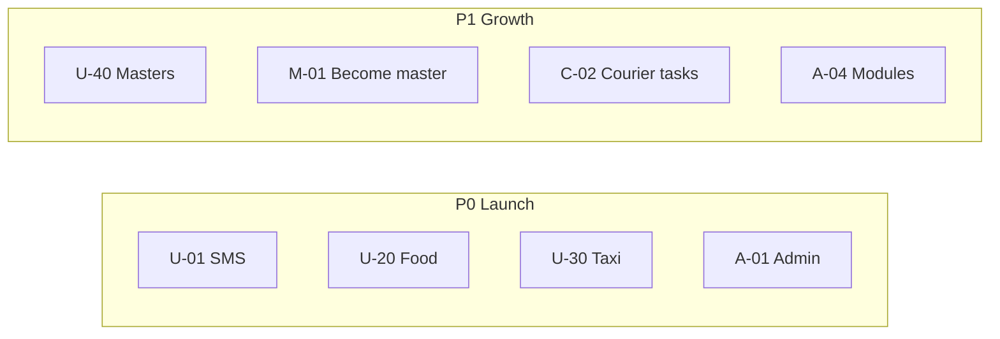

# User Stories — Sortirovka24

Пользовательские истории по ролям. Формат: **Как [роль], я хочу [действие], чтобы [ценность]**.

Приоритет: **P0** — критично для запуска, **P1** — важно, **P2** — улучшение.

---

## Житель (user)

### Регистрация и вход

| ID | История | Приоритет | Критерии приёмки |
|----|---------|-----------|------------------|
| U-01 | Как житель, хочу зарегистрироваться по номеру телефона, чтобы пользоваться заказами и кабинетом | P0 | SMS приходит; после кода — аккаунт и JWT; бонус начислен |
| U-02 | Как житель, хочу войти через Google, чтобы не запоминать пароль | P1 | OAuth redirect работает; профиль создан |
| U-03 | Как житель, хочу переключить язык RU/KZ, чтобы читать интерфейс на родном языке | P0 | Переключатель в header; тексты меняются |
| U-04 | Как житель, хочу оставаться в аккаунте после перезапуска приложения, чтобы не логиниться каждый раз | P0 | JWT 30 дней; не разлогинивает при сетевой ошибке |

### Главная и контент

| ID | История | Приоритет | Критерии приёмки |
|----|---------|-----------|------------------|
| U-10 | Как житель, хочу видеть плитки сервисов на главной, чтобы быстро перейти к нужному | P0 | Плитки модулей; скрыты выключенные |
| U-11 | Как житель, хочу читать новости района, чтобы быть в курсе событий | P0 | Лента `/news`; детальная страница; фото |
| U-12 | Как житель, хочу смотреть объявления соседей, чтобы купить/продать локально | P0 | Лента `/announcements`; фильтр активных |
| U-13 | Как житель, хочу подать жалобу в ЖКХ с фото, чтобы проблему увидели | P1 | Форма с upload; статус жалобы |
| U-14 | Как житель, хочу видеть погоду на главной, чтобы одеться по погоде | P2 | Виджет temp + иконка |

### Еда DAM ALEM

| ID | История | Приоритет | Критерии приёмки |
|----|---------|-----------|------------------|
| U-20 | Как житель, хочу заказать еду из меню DAM ALEM, чтобы получить доставку домой | P0 | Каталог → корзина → заказ; подтверждение |
| U-21 | Как житель, хочу указать адрес доставки, чтобы курьер нашёл меня | P0 | Сохранённые адреса; geocode |
| U-22 | Как житель, хочу отслеживать статус заказа, чтобы знать когда ждать | P1 | `/delivery/food/:orderId` |
| U-23 | Как житель, хочу получить бонусы за заказ, чтобы копить на следующие | P1 | `FOOD_ORDER_BONUS_POINTS` в кабинете |
| U-24 | Как житель, хочу заказать с точки в парке (Food Park), чтобы забрать/получить у павильона | P1 | SVG-карта; выбор точки |

### Такси

| ID | История | Приоритет | Критерии приёмки |
|----|---------|-----------|------------------|
| U-30 | Как житель, хочу вызвать такси по району, чтобы доехать без звонка диспетчеру | P0 | `/taxi` → quote → ride |
| U-31 | Как житель, хочу видеть статус поездки на карте/экране, чтобы понимать где машина | P1 | `/taxi/ride/:id` |
| U-32 | Как житель, хочу отменить поездку до посадки, чтобы не платить зря | P1 | Cancel endpoint |

### Мастера и сообщество

| ID | История | Приоритет | Критерии приёмки |
|----|---------|-----------|------------------|
| U-40 | Как житель, хочу найти мастера (сантехник, электрик), чтобы решить бытовую проблему | P1 | Каталог `/masters`; профиль |
| U-41 | Как житель, хочу оставить заявку мастеру, чтобы он связался со мной | P1 | Форма заявки; auth required |
| U-42 | Как житель, хочу задать вопрос соседям, чтобы получить совет | P2 | `/questions` |
| U-43 | Как житель, хочу найти телефон участкового, чтобы обратиться по безопасности | P2 | `/inspectors` |

### Кабинет

| ID | История | Приоритет | Критерии приёмки |
|----|---------|-----------|------------------|
| U-50 | Как житель, хочу видеть историю заказов и бонусы, чтобы контролировать траты | P1 | `/cabinet` |
| U-51 | Как житель, хочу редактировать профиль и аватар, чтобы меня узнавали | P1 | PUT `/me`; avatar upload |

---

## Мастер (master)

| ID | История | Приоритет | Критерии приёмки |
|----|---------|-----------|------------------|
| M-01 | Как мастер, хочу подать заявку «стать мастером», чтобы попасть в каталог | P1 | Форма `/masters/become`; модерация |
| M-02 | Как мастер, хочу видеть входящие заявки в кабинете, чтобы отвечать клиентам | P1 | `/cabinet/master` |
| M-03 | Как мастер, хочу обновить профиль и фото работ, чтобы привлекать заказы | P1 | PUT `/master/profile` |
| M-04 | Как мастер, хочу менять статус заявки (принял/выполнил), чтобы житель видел прогресс | P1 | PUT status |

---

## Водитель такси (driver)

| ID | История | Приоритет | Критерии приёмки |
|----|---------|-----------|------------------|
| D-01 | Как водитель, хочу подать заявку на подключение, чтобы начать работать | P1 | `/taxi/driver/application` |
| D-02 | Как водитель, хочу выйти на линию, чтобы получать заказы | P0 | PUT `/driver/online` |
| D-03 | Как водитель, хочу принять/отклонить поездку, чтобы управлять загрузкой | P0 | accept/decline |
| D-04 | Как водитель, хочу обновлять GPS, чтобы пассажир видел машину | P1 | PUT `/driver/location` |
| D-05 | Как водитель, хочу видеть кабинет с балансом и поездками | P1 | `/cabinet/driver` |

---

## Курьер (courier)

| ID | История | Приоритет | Критерии приёмки |
|----|---------|-----------|------------------|
| C-01 | Как курьер, хочу подать заявку, чтобы доставлять еду | P1 | `/logistics/courier/application` |
| C-02 | Как курьер, хочу видеть задачи доставки, чтобы забирать заказы | P0 | `/cabinet/courier` или `/food/courier` |
| C-03 | Как курьер, хочу отметить «доставлено», чтобы заказ закрылся | P0 | POST task status |
| C-04 | Как курьер, хочу получать уведомления в Telegram, чтобы не пропустить заказ | P1 | Telegram courier bot |

---

## Партнёр / продавец (seller)

| ID | История | Приоритет | Критерии приёмки |
|----|---------|-----------|------------------|
| P-01 | Как партнёр, хочу управлять витриной (Гастроном/Прораб), чтобы продавать через приложение | P1 | Admin + partner flows |
| P-02 | Как партнёр, хочу видеть заказы в кабинете, чтобы их обрабатывать | P1 | `/cabinet/partner` |
| P-03 | Как партнёр, хочу получать Telegram при новом заказе | P1 | Telegram gastronom bot |

---

## Оператор DAM ALEM (через Telegram)

| ID | История | Приоритет | Критерии приёмки |
|----|---------|-----------|------------------|
| O-01 | Как оператор, хочу получать новый заказ в Telegram, чтобы подтвердить его | P0 | Сообщение в chat FOOD |
| O-02 | Как оператор, хочу нажать кнопку «Подтвердить» в Telegram, чтобы статус обновился | P0 | Webhook inline |
| O-03 | Как оператор, хочу чтобы заказ ушёл в FrontPad, чтобы касса его видела | P0 | auto push / manual sync |

---

## Модератор / администратор

| ID | История | Приоритет | Критерии приёмки |
|----|---------|-----------|------------------|
| A-01 | Как админ, хочу войти в `/admin`, чтобы управлять контентом | P0 | JWT login; sidebar |
| A-02 | Как админ, хочу публиковать новость, чтобы жители её увидели | P0 | AdminNews CRUD |
| A-03 | Как админ, хочу модерировать объявления и жалобы | P0 | Status change |
| A-04 | Как админ, хочу выключить модуль одной кнопкой, чтобы быстро отключить сервис | P1 | AdminModules |
| A-05 | Как админ, хочу отправить push всем, чтобы сообщить важное | P1 | AdminPush broadcast |
| A-06 | Как админ, хочу синхронизировать меню FrontPad, чтобы каталог был актуален | P0 | AdminFrontpad sync |
| A-07 | Как админ, хочу одобрить заявку мастера/водителя/курьера | P1 | Approve endpoints |
| A-08 | Как админ, хочу видеть статистику активности | P2 | AdminStats |
| A-09 | Как админ, хочу управлять такси и тарифами | P1 | AdminTaxi |
| A-10 | Как админ, хочу работать с телефона через Admin APK | P2 | `kz.sortirovka24.admin` |

---

## Карта историй по модулям

---

## Definition of Done (общий)

История считается выполненной, когда:

1. Работает на **web + Android APK** с prod API
2. Есть обработка ошибок (toast / fallback UI)
3. RU и KZ тексты (где UI)
4. Не ломает выключенный module guard
5. Критичные flow покрыты в [TESTING_CHECKLIST.md](../app/frontend/TESTING_CHECKLIST.md)

---

## Связанные документы

- [Цели и видение](./02-ЦЕЛИ-И-ВИДЕНИЕ.md)
- [Модули](./04-МОДУЛИ.md)
- [API Reference](./09-API-REFERENCE.md)
