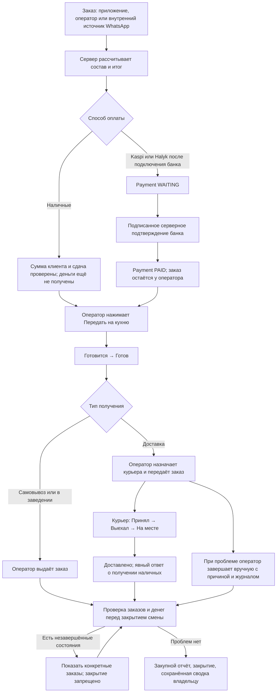

# Däm Әlem: заказ, деньги, доставка и завершение смены

Дата проверки: 28 сентября 2026 года. Основа: существующий проект Sortirovka24, коммит `1f9a041`. Изменения в этом отчёте подготовлены локально. Production и его данные в ходе этого этапа не изменялись.

## 1. Что было до изменений

Уже существовали Food_orders, LogisticsTask, персональные FoodShift, FoodStaffAction, FoodOrderEvent, FoodRefund, FoodExpense, журнал денег курьеров и одна общая касса FoodCashEntry. Кабинеты владельца, оператора и курьера работали с общей базой. Обновление экранов выполнялось существующим polling. Клиентский чек использовал единый HTML для браузерной и Android-печати.

Аудит выявил противоречия новому заданию:

- Сотрудник мог отметить банковский способ оплаты как оплаченный вручную.
- Отдельной платёжной попытки и проверенного банковского callback не было.
- Назначение курьера сразу означало «в пути», без отдельных действий принятия и выезда.
- Не хранились сумма, которую даст клиент, и рассчитанная сдача.
- Не было безопасного отдельного ручного завершения доставки оператором.
- Проверка закрытия смены искала активные заказы, но пропускала завершённые неоплаченные заказы.
- Внешняя отправка в Frontpad могла происходить при создании заказа, раньше решения оператора.
- Привязка записи сотрудника к номеру ручного заказа выполнялась вторым commit. Теперь она входит в транзакцию создания заказа.

Существующие идентификаторы, статусы и история сохранены. Новая параллельная система заказов или отдельная кассовая смена не создавалась.

## 2. Как работает вся цепочка

Источник заказа и тип получения остаются независимыми. `app`, `operator`, `whatsapp` не определяют, будет ли заказ доставкой, самовывозом или обслуживанием в заведении.

## 3. Сущности и миграция

Добавлена миграция `dam20261001_payment_lifecycle` после `dam20260930_shared_cashbox`.

Новые таблицы:

- `food_payments`: id, order_id, user_id, provider, amount, currency, status, external_id, created_at, paid_at, failed_at, expired_at, refunded_at, metadata. Сумма — Numeric(14,2). Уникальная пара provider/external_id не даёт привязать один банковский платёж к разным заказам.
- `food_payment_callbacks`: идентификатор события провайдера, payment_id, hash нормализованного события, дата. Повтор того же события не начисляет деньги второй раз; изменение содержимого под тем же идентификатором даёт конфликт.

Расширены существующие таблицы:

- `food_orders`: cash_given_amount, change_amount.
- `logistics_tasks`: handed_at, departed_at, arrived_at; прежние picked_up_at/delivered_at сохранены.
- `food_shifts`: closing_summary — сохранённая сводка при закрытии.
- `food_order_events`: event_type, event_key, event_data; event_key уникален.

Миграция не переименовывает старые значения и не приписывает историческим заказам выдуманные оплаты. Проверяется повторное применение, сохранение исторического заказа и проход старой цепочки Alembic. Удаляющий финансовую историю downgrade намеренно запрещён.

## 4. Используемые статусы

В базе заказа сохранены: `new`, `confirmed`, `preparing`, `ready`, `in_progress`, `done`, `cancelled`.

- `new`/`confirmed`: заказ виден оператору. Для банка до оплаты смысл — WAITING_PAYMENT, после оплаты — READY_FOR_OPERATOR.
- `preparing`: COOKING. Вход в этот статус порождает событие SENT_TO_KITCHEN только по действию оператора.
- `ready`: READY.
- `in_progress`: доставка; отдельный LogisticsTask хранит фактический этап.
- `done`: DELIVERED/выдан — в зависимости от типа получения.
- `cancelled`: CANCELLED.

Этапы доставки: `assigned` → `picked_up` → `on_the_way` → `arrived` → `delivered`. Назначение больше не означает, что курьер уже выехал. Карточка заказа возвращает проекцию HANDED_TO_COURIER либо COURIER_ON_THE_WAY по фактическому этапу доставки.

Статусы Payment: CREATED, WAITING, PAID, FAILED, EXPIRED, REFUNDED. В существующем заказе сохраняются совместимые `pending`, `paid`, `refunded`. Для ожидающих наличных API карточки отдаёт понятное `payment_state=CASH_PENDING`.

`done + pending` допустим: заказ получен, деньги ещё не подтверждены. Это не превращает заказ в оплаченный и блокирует закрытие смены оператора.

## 5. API

Новые маршруты:

- `GET /api/v1/dam-alem/payments/capabilities`: доступность способов автоматической оплаты.
- `POST /api/v1/dam-alem/payments/webhook`: проверка подписи адаптером и транзакционная обработка подтверждения. В текущей реализации доступен только в изолированной тестовой среде.
- `POST /api/v1/dam-alem/operations/orders/{id}/manual-delivery`: ручное завершение с expected_version, reason, cash_received, amount, comment.

Расширены существующие checkout, ручное создание/изменение состава заказа, карточка оператора, кабинет курьера, история клиента, закрытие смены и возврат владельца. Существующие маршруты, авторизация и проверки ролей сохранены.

## 6. Kaspi / Halyk

Сервер создаёт платёж на рассчитанную им сумму. Только адаптер, проверивший серверное событие, может подтвердить деньги. Redirect клиента не подтверждает оплату. Оператор и владелец не могут нажатием кнопки выдать банковскому заказу PAID.

Успешное подтверждение записывает платёж, денежное движение, audit и обновление заказа одной транзакцией. Повторные события безопасны. FAILED/EXPIRED не начисляют деньги. Поздний PAID после отмены учитывает реально пришедшие деньги, но не восстанавливает отменённый заказ: владельцу требуется оформить возврат.

PAID не меняет готовность заказа. Только «Передать на кухню» запускает приготовление. Существующая отправка в Frontpad перенесена на это действие; реальное подключение Frontpad не проверялось, транспорт проверен подменой.

**Реальные банковские адаптеры ещё не подключены.** Сейчас новый Kaspi/Halyk нельзя оформить как будто работающую онлайн-оплату: варианты явно отключены, backend возвращает 503 при отсутствии провайдера. Наличные доступны. Это существенное изменение относительно прежнего простого выбора способа оплаты; перед выпуском его нужно учитывать.

Тестовый HMAC-провайдер требует одновременно APP_ENV=test, EXTERNAL_SIDE_EFFECTS=disabled, PAYMENT_TEST_SECRET и отсутствие Railway environment id. Он не включён для production и не имитирует договорный API банка.

## 7. Наличные и общая касса

Клиент и оператор выбирают «Без сдачи», 5 000, 10 000, 20 000 или вводят сумму. Сервер заново проверяет итог и рассчитывает сдачу. Для заказа 7 800 и купюры 8 000 сохраняются 8 000 и 200. Сумма меньше заказа отклоняется.

Данные видны оператору, курьеру, в клиентском и кухонном чеках. Для старых заказов без указанной суммы выводится «уточните», а не выдуманное значение.

Курьер подтверждает получение наличных явно. При положительном ответе меняются платёж и доставка. При отрицательном заказ может быть доставлен, но остаётся неоплаченным.

**Деньги у курьера не равны деньгам в общей кассе.** Получение клиентских наличных пополняет журнал курьера. Общая касса увеличивается после подтверждённой передачи денег. Расход, изъятие, внесение и корректировка общей кассы сохранены. Банковская оплата не увеличивает физическую кассу.

## 8. Ручное завершение

В карточке доставки есть «Завершить доставку вручную». Оператор выбирает: сообщил курьер / подтвердил клиент / другое. Для неоплаченных наличных нельзя продолжить без выбора «Да» или «Нет». Сумма по умолчанию — неполученный остаток; частичная сумма допустима, но остаток остаётся долгом.

Комментарий обязателен для «другое», неполученных денег и нестандартной суммы. Нельзя получить больше оставшегося долга. Завершение доступно только для действительно назначенной доставки, с проверкой роли, своей открытой смены и версии заказа. Владелец сохраняет управленческий доступ без искусственной смены.

Audit содержит сотрудника, время, заказ, старый/новый этап доставки, старый/новый статус заказа, оплату, подтверждающего, комментарий и источник operator_manual. Повтор запроса не повторяет деньги, начисление курьеру или журнал завершения.

## 9. Закрытие смены

Проверка выполняется на backend повторно в момент закрытия, под существующей блокировкой операций Däm Әlem. Появившийся после preview новый заказ не даёт закрыть смену по устаревшему экрану.

Блокируют закрытие:

- текущие незавершённые заказы и доставки;
- завершённые заказы с неподтверждёнными деньгами;
- ожидающие банковские попытки;
- оплаченные отмены/переплаты, требующие возврата;
- открытые проблемы доставки.

Будущие предзаказы сохраняют прежние правила временного окна. После устранения причин оператор заполняет существующий закупной отчёт и закрывает смену своим PIN. Сохраняются количество обработанных заказов, завершения, отмены, выручка, поступления по методам, возвраты и нулевое число блокирующих вопросов.

Границы показателей указаны прямо в интерфейсе: заказы — те, с которыми работал сотрудник; поступления — денежные события бизнеса за время его смены, включая полученное курьерами. **Параллельные персональные смены нельзя складывать как независимые финансовые периоды.** Эта сводка не является новым фискальным отчётом или пересчётом физической кассы.

Для исторических записей границы времени сравниваются в UTC с учётом сохранённого часового пояса. Поступления с неизвестным старым способом оплаты не теряются: выводятся отдельно как неуказанный способ.

## 10. События и защита

Типизированные события сохранены в существующем журнале: PAYMENT_CONFIRMED, SENT_TO_KITCHEN, ORDER_READY, HANDED_TO_COURIER, COURIER_ON_THE_WAY, DELIVERED и дополнительные события отмены, возврата, этапов доставки.

Это точки подключения notification service. Они не означают, что новые live-каналы WhatsApp/SMS уже подключены. Существующие уведомления сохранены; новый внешний канал не создавался.

Используются существующая PostgreSQL advisory transaction lock, блокировки строк, expected_version, уникальные ключи запросов/платежей/событий. Сумму, факт оплаты и доставку клиент через checkout не задаёт. Роли проверяет backend. История не удаляется.

## 11. Проверки и ограничения

Результаты выполненных прогонов:

- Полный backend: **437 passed, 0 failed, 22 skipped** (16 мин 48 с). Лог: `.cache/payment-final-backend.log`.
- Дополнительный прогон платёжной логики и совместимости заказов после финальной правки атомарного audit: **61 passed, 0 failed**. Лог: `.cache/payment-final-workflow.log`. Эти проверки пересекаются с полным набором; складывать количества не нужно.
- Финальный изолированный прогон жизненного цикла оплаты и миграции, включая новую проверку временных границ сводки: **26 passed, 0 failed**. Лог: `.cache/payment-final-isolated.log`. Зависимость от порядка импорта тестов устранена.
- Frontend: **typecheck — успешно, lint — успешно, production build — успешно**. Сборка проверена через Vite preview в браузерных сценариях.
- Браузер: **116 passed, 0 failed**: оператор — 10; расширенные сценарии оператора — 32; курьер — 30; общая касса — 12; чеки и QR — 28; реальный локальный API + интерфейс — 4.
- Последние 4 сквозных браузерных сценария повторены после финальных изменений: **4 passed**. Приложение работало с настоящим временным backend и БД, без production-данных.
- Python compileall и `git diff --check` — успешно.
- Миграция применена к временной локальной БД, включая повторное применение и проверку сохранения старого заказа. Старая цепочка миграций также покрыта тестами полного набора.

Причины 22 пропусков: 20 параметризованных проверок требуют отдельный PostgreSQL URL; одна проверка конкуренции кассы пропущена на SQLite, потому что ей нужна PostgreSQL advisory lock; одна существующая проверка парковочного курьера пропущена из-за отсутствия тестового курьера. Это не подтверждение работы PostgreSQL-конкуренции: её ещё нужно проверить на отдельной PostgreSQL перед production.

Матрица источника и получения — все **9 прошли** через создание, операторские статусы и завершение:

- Приложение/сайт → доставка: passed, с назначением курьера.
- Приложение/сайт → самовывоз: passed, без курьера.
- Приложение/сайт → в заведении: passed, без адреса и курьера.
- Оператор → доставка: passed, с назначением курьера.
- Оператор → самовывоз: passed, без курьера.
- Оператор → в заведении: passed, без адреса и курьера.
- Внутренний источник WhatsApp → доставка: passed, с назначением курьера.
- Внутренний источник WhatsApp → самовывоз: passed, без курьера.
- Внутренний источник WhatsApp → в заведении: passed, без адреса и курьера.

WhatsApp в этой матрице означает сохранённое поле источника. Входящее сообщение из настоящего WhatsApp и создание заказа из него этим не проверены.

Падение отдельного запуска тестов закрытия смены оказалось проблемой тестовой подготовки: таблица общей кассы регистрировалась только при импорте другого теста. В общий fixture добавлен явный импорт модели до `create_all`. Production-код ради этого не изменялся, проверка не удалялась.

Проверены новые сценарии: Kaspi/Halyk success, WAITING/FAILED/EXPIRED, подпись и сумма callback, повторное событие, поздняя оплата после отмены и возврат, отсутствие автоматической кухни, явная передача оператором, наличные без сдачи и 8 000/7 800, недостаточная сумма, курьерское и ручное завершение, частичная/неполученная оплата, audit, блокировка и сохранение закрытия смены, повторы доставки. Отдельно сохранена матрица 3 источника × 3 способа получения.

Браузерная цепочка использует отдельный запущенный FastAPI и временную SQLite, а не только mock-ответы. В ней реально создаётся заказ через форму, меняются статусы, выполняется вход курьера по PIN, подтверждается наличная оплата, обновляются данные владельца, закрывается смена через UI и проверяется сохранение после refresh. Второй сценарий проверяет диалог ручного завершения и audit владельца. Размеры экрана: 390 и 1440 px.

Дополнительные UI suites используют контролируемые API-ответы для ошибок связи, прав, фильтров, нескольких доставок и двойных действий; их нельзя выдавать за live-проверку внешних сервисов.

Оставшиеся предупреждения: 41 backend warning о deprecated Pydantic Config и совместимости Starlette/httpx/anyio; в сборке — устаревшая база Browserslist, существующая неоднозначность `delay-[25ms]`, смешанный статический/динамический импорт monitoring и крупные JS chunks. Они не остановили сборку, но не считаются исправленными этим этапом.

Ограничения: production не обновлялся; реальные Kaspi/Halyk, физический принтер, реальный Android APK, доставка SMS/Push/WhatsApp и Frontpad не проверены этим локальным прогоном. PostgreSQL-интеграционные тесты требуют отдельную тестовую PostgreSQL; production для них не используется. Существующие исторические долги не обнуляются и могут блокировать новое строгое закрытие — их потребуется разобрать по реальным оплатам/возвратам.

## 12. Что требуется для настоящих банков

Для Kaspi и отдельно для Halyk необходимо выбрать доступный бизнесу продукт банка или платёжного партнёра, получить его официальные условия подключения, тестовый доступ и протокол. Затем реализовать соответствующий адаптер: создание платежа, проверку подлинности callback, сопоставление суммы/валюты/идентификатора, проверку статуса и разбор поздних/повторных событий.

После этого настроить серверные секреты и HTTPS callback, провести тестовую оплату, отказ, истечение срока, повтор, отмену и возврат, сверить реальное поступление денег. Только после этого включать способ оплаты в checkout. Существующее действие владельца «отметить возврат» само по себе не отправляет деньги через банк; автоматический банковский refund также требует подтверждённого API.

Основные файлы реализации: `app/backend/services/dam_payment_flow.py`, `payment_providers.py`, `dam_order_workflow.py`, `logistics_service.py`, `food_procurement.py`, `dam_shift_summary.py`; маршруты `dam_payments.py`, `food_operations.py`, `food_shifts.py`; интерфейсы `CashAmount.tsx`, `ManualDeliveryDialog.tsx`, `DamCourierWorkplace.tsx`, `ShiftCloseDialog.tsx`, `DamAlemOrders.tsx`; миграция `dam20261001_payment_lifecycle.py`.
