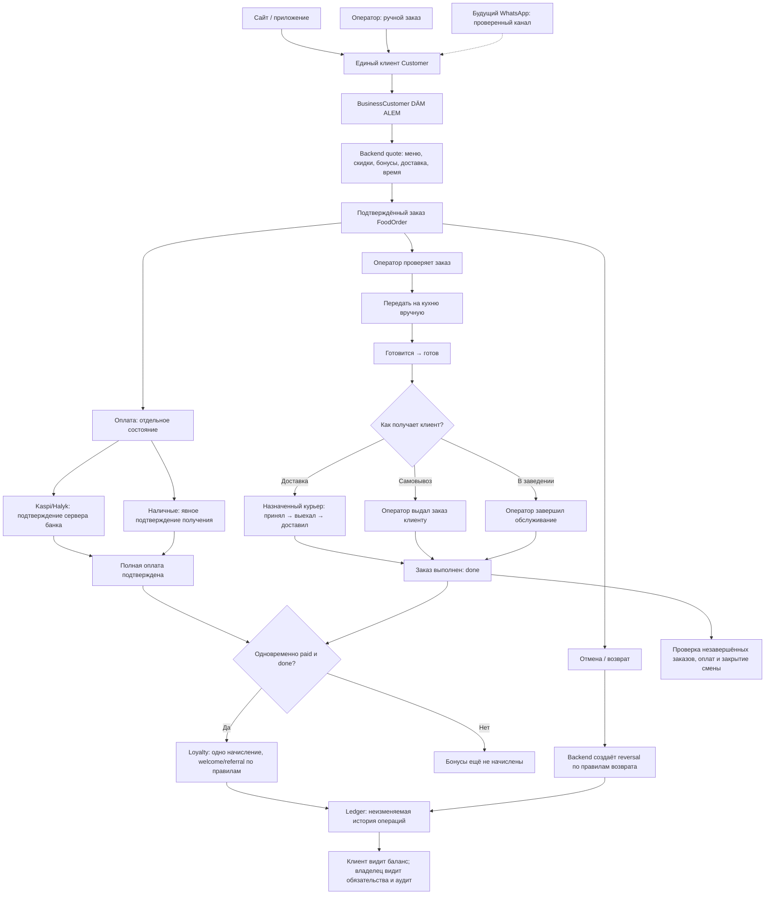
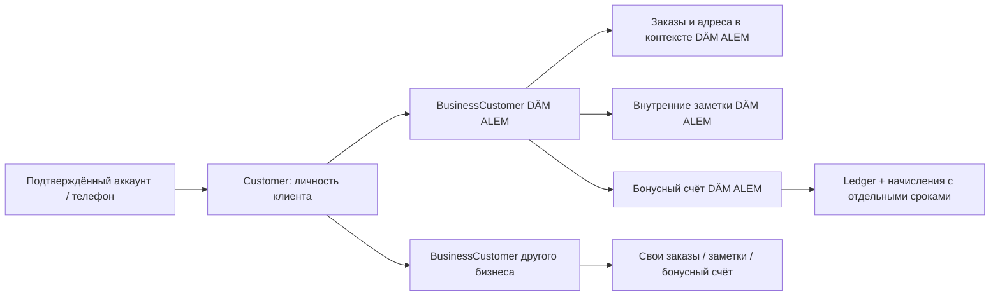

# DÄM ALEM: инструкция по кабинетам, заказам, клиентам и бонусам

Версия инструкции: 28 сентября 2026 года. Основана на локально реализованном и проверенном коде.

**Опубликовано 2 октября 2026 года, production build `8e529c6`.** Маршруты кабинетов и API проверены после выпуска. [Отчёт публикации и ограничения](pwa-production-release-2026-10-02.md). Реальные банковские платежи, WhatsApp и аппаратные push-тесты не объявляются подключёнными только на основании деплоя.

[Технический отчёт, проверки и ограничения](dam-crm-loyalty-report-2026-09-28.md).

## 1. Кто за что отвечает

Владелец управляет бизнесом: финансы, сотрудники, меню, настройки, CRM, бонусы. Для входа владельцу не нужна рабочая смена и не требуется PIN.

Оператор принимает/создаёт заказы, проверяет их, передаёт кухне, организует выдачу или доставку, работает с оплатой в разрешённых пределах и закрывает персональную смену.

Курьер входит отдельно, видит назначенные доставки, адрес/телефон/состав/сумму/сдачу и сообщает этап доставки. Ему не открывается общий кабинет владельца.

Клиент оформляет заказ, наблюдает статус, управляет своими адресами и видит бонусы. Подтверждённый телефон связывает аккаунт с его прежней историей заказов.

Администратор Sortirovka24 управляет платформой; это отдельная роль, не повседневная замена владельцу ресторана.

## 2. Куда заходить

- [Владелец DÄM ALEM](https://www.sortirovka24.kz/partner/dam-alem).
- [Клиенты владельца](https://www.sortirovka24.kz/partner/dam-alem?section=crm).
- [Бонусы владельца](https://www.sortirovka24.kz/partner/dam-alem?section=loyalty).
- [Команда и смены](https://www.sortirovka24.kz/partner/dam-alem?section=staff).
- [Настройки заведения и самовывоза](https://www.sortirovka24.kz/partner/dam-alem?section=settings).
- [Рабочее место оператора](https://www.sortirovka24.kz/partner/dam-alem/operator).
- [Отдельный кабинет курьера](https://www.sortirovka24.kz/food/courier).
- [Меню и оформление заказа](https://www.sortirovka24.kz/food).
- [Личный кабинет клиента](https://www.sortirovka24.kz/cabinet).
- [Бонусы клиента](https://www.sortirovka24.kz/cabinet?tab=bonuses).
- [Административная панель платформы](https://www.sortirovka24.kz/admin).

Логины, пароли и PIN в этой задаче не создавались и не менялись. Используйте существующий доступ. Текущий пароль из hash обратно не извлекается. Если сотруднику требуется новый доступ, владелец создаёт/изменяет его через Команду и передаёт сотруднику персональные данные безопасным способом.

Дополнительные маршруты платформы — /cabinet/master, /cabinet/driver, /cabinet/partner, /cabinet/admin — сохранены. Они требуют соответствующей роли и не являются отдельными кабинетами оператора/курьера DÄM ALEM. Их полный функциональный аудит не является результатом этого CRM-этапа.

## 3. Общая схема

Статусы выполнения и оплаты меняются независимо. Подтверждение оплаты не запускает кухню. Для предзаказа хранится выбранное время, а оператор видит, когда начинать готовить. Связь с WhatsApp пунктирная: внешний канал ещё не подключён.

Один человек не получает отдельного клиента из-за смены канала заказа. При этом баланс, заметки и история взаимодействия с конкретным бизнесом изолированы от других партнёров.

Смысл схемы: один клиент и один заказ сохраняются в backend. Меняются поля состояния, а разные кабинеты показывают ту же запись. Источник заказа не создаёт отдельный баланс или отдельную базу клиентов.

## 4. Подготовка владельцем

### Доступ сотрудников

1. Войти в кабинет владельца обычным логином/паролем.
2. Открыть Команду.
3. Создать оператора: имя человека, логин/email, роль, новый пароль с повтором, персональный PIN из четырёх цифр.
4. Создать курьера в существующем блоке курьеров: имя, телефон и персональный PIN.
5. Проверить активность доступа. Выключенный сотрудник не должен продолжать входить или выполнять защищённые действия.

История заказов/действий остаётся при отключении доступа. Название ресторана не следует использовать вместо имени сотрудника.

### Точка самовывоза

1. Настройки → «Предзаказы и точка самовывоза».
2. Название: DÄM ALEM 2.0.
3. Адрес/место: Парк Железнодорожников.
4. Ориентир: бывший фонтан; дополнить понятной инструкцией подхода.
5. Загрузить реальную фотографию входа/точки. Предпросмотр покажет клиентский вид.
6. Указать широту и долготу. Кнопку «Я на точке — определить координаты» использовать только у реальной точки.
7. Проверить маршрут и сохранить.

Координаты изначально не придуманы. Пока они пусты, точного маршрута нет. Старые курьерские logistics settings пока отдельные: перед реальными доставками также сверить их точку забора. Сохранение новой точки самовывоза не переписывает старые курьерские задачи.

### Предзаказы

В том же блоке указать: разрешены ли предзаказы, минимум минут до получения, горизонт дней, шаг времени и время начала подготовки. Начальные значения: 30 минут / 7 дней / 30 минут / подготовка за 30 минут. При необходимости ввести закрытые даты через запятую в формате ГГГГ-ММ-ДД.

Слоты используют общее расписание заведения. Не нужно вручную создавать каждый час. Если рабочее расписание неверно, сначала исправить его в настройках ресторана.

### Бонусная программа

Бонусы → Правила. Начальные параметры:

- Начисление — 3% оплаченной еды после скидок и списания бонусов.
- Максимум списания — 20% еды после скидок/промокода.
- Welcome — 300, срок 14 дней.
- Обычные начисления — 60 дней.
- Приглашение друга — 300 после его квалифицирующего заказа.
- 1 бонус = 1 ₸ скидки, без выдачи наличных.

Есть переключатели начисления, списания, referral, автоматического участия новых клиентов и пороги проверки подозрительных операций. Сохранение записывает автора/старые/новые значения. Старые заказы не пересчитываются.

**До запуска на реальных клиентах:** сверить старые бонусные обязательства и записи, отмеченные для проверки миграции. Не считать отсутствующий автоматически перенесённый баланс доказательством, что у бизнеса не было старого обязательства.

## 5. Начало рабочего дня оператора

1. Открыть рабочее место оператора на ноутбуке.
2. Если компьютер ещё не авторизован как рабочее место, выполнить предусмотренную настройку через учётную запись владельца. Это отдельный первый шаг доверия компьютеру.
3. Оператор вводит свой персональный PIN. Открывается его смена; действия получают его авторство.
4. Проверить новые заказы и блок предзаказов.

Блокировка экрана сохраняет открытую смену. Она не равна закрытию смены. После refresh данные приходят с backend. Приложение не должно считать завершённым действие только потому, что пользователь нажал кнопку.

Пароль владельца не нужно сообщать каждому сотруднику для ежедневного входа: владельцу достаточно подготовить рабочее место, а сотрудник использует личный PIN.

## 6. Клиент и CRM

В форме «Новый заказ» ввести имя или телефон. Если клиент найден, выбрать его. «История» открывает карточку с заказами именно DÄM ALEM, балансом, ранее использованными здесь адресами и заметками.

Если клиента нет, заполнить имя/телефон: customer появляется при заказе. Регистрация в приложении не обязательна для существования клиента в CRM.

Телефон +7 700… и запись 8 700… не должны создавать два customer. Сайт, оператор и будущий WhatsApp используют одну идентичность. Но одного совпадения непроверенного телефона в аккаунте недостаточно для выдачи чужого баланса.

Внутренняя заметка — для работников бизнеса. Клиент не видит её в своём кабинете. Комментарий клиента к конкретному заказу — другая сущность; он доступен тем, кому нужен для выполнения заказа.

Оператор не видит всю адресную книгу клиента и историю покупок у других партнёров. При недоступности поиска можно ввести контакт вручную; сервер всё равно проверит идентичность и цену.

## 7. Как клиент оформляет заказ

1. Открыть меню, выбрать блюда и количество.
2. Выбрать получение: доставка, самовывоз или в заведении.
3. Для доставки ввести/выбрать адрес. Для самовывоза увидеть точку получения. Для «в заведении» адрес доставки не нужен.
4. Выбрать «Как можно скорее» либо доступную дату/время.
5. Добавить комментарий, например «позвоните у входа» или «заберу к 18:30».
6. Применить промокод при наличии. При желании указать доступное бонусное списание.
7. Выбрать способ оплаты. При наличных — без сдачи или сумму, с которой нужна сдача.
8. Проверить итог, который посчитал сервер, и подтвердить заказ.

Если цена/доступность/слот изменились, сервер может потребовать обновить расчёт. Старый итог в открытой вкладке не гарантирует старую цену. Произвольный total, переданный браузером, не становится ценой заказа.

Для подтверждения собственного телефона в кабинете использовать показанный SMS-flow. Код вручную не придумывается. Реальная доставка SMS зависит от работающего SMS-провайдера; локальные тесты не подтверждают его текущий баланс или договор.

## 8. Источник и получение — разные вещи

Источник: приложение/сайт, оператор, WhatsApp. Получение: доставка, самовывоз, в заведении. Время: ASAP или предзаказ.

Например, «WhatsApp + самовывоз завтра к 18:30» и «оператор + доставка сейчас» — нормальные сочетания. Ни источник, ни предзаказ не должны автоматически включать курьера. Курьер нужен для delivery.

Реальный WhatsApp intake пока не подключён. Внутренний source=whatsapp и единая обработка уже проверены, но сообщения клиентов ещё не превращаются в заказы автоматически через Meta/provider.

## 9. Обработка и выдача заказа

Оператор проверяет клиента, состав, комментарий, получение/время, итог и оплату. Затем использует существующие действия подтверждения и «Передать на кухню».

Кухня получает заказ после действия оператора. Оплачено не означает «уже отправлено готовиться». Кухонная печать не должна выдавать ещё не переданный заказ как производственное задание.

После готовности:

- **Доставка:** выбрать доступного курьера и передать ему заказ. В его кабинете появляется именно назначенная доставка.
- **Самовывоз:** выдать клиенту и завершить через действие выдачи без курьера.
- **В заведении:** завершить через соответствующее действие без курьера/адреса.

Технические значения существующих статусов FoodOrder: new → confirmed → preparing → ready → in_progress для доставки → done. Для pickup/dine_in после ready — завершение без доставки. cancelled — отдельный исход. Интерфейс показывает русские названия; статусы логистической задачи детализируют действия курьера.

Кабинеты обновляются через существующий polling. Сразу после успешного действия видно новое состояние; другой открытый кабинет увидит его при обновлении данных. Это не обещание нулевой задержки или работы без сети.

## 10. Оплата отдельно от выполнения

Заказ может быть завершён, но не оплачен. Это долг, а не основание автоматически поставить «оплачено». Оплаченный, но не выданный заказ не получает cashback.

Kaspi/Halyk: реальный PAID должен прийти через доверенный серверный платёжный flow провайдера. Клиентский redirect/success не подтверждает деньги. Реальные банковские подключения этим этапом не завершены; без конфигурации успешная банковская оплата не имитируется. Проверки success/failed/duplicate работают с тестовыми adapters.

Наличные: сервер считает сдачу. Пример: итог 7 800, клиент даст 8 000, сдача 200. Сумма «клиент даст» меньше итога отклоняется. Выбор «без сдачи» означает наличные ровно по итоговой сумме.

Оператор/курьер явно фиксирует получение денег. Статус выполнения сам по себе этого не делает. Финансовые отчёты различают продажи, полученные деньги, расходы и возвраты.

## 11. Работа курьера

1. Открыть отдельный /food/courier и войти персональным PIN.
2. Открыть назначенную доставку.
3. Проверить телефон, адрес, состав, комментарий, сумму и оплату.
4. При cash увидеть «к оплате», «клиент даст» и «сдача».
5. Пройти доступные этапы: принял → выехал → на месте → доставлено.
6. Для наличных явно подтвердить факт получения денег.

Получение наличных курьером и передача этих денег в общую кассу — отдельные события. Деньги у курьера не следует считать автоматически лежащими в кассе. Используется существующая логика учёта/сдачи денег.

Если телефон сел/пропал интернет, оператор может вручную завершить доставку через предусмотренный диалог: кто подтвердил, причина/комментарий, получены ли деньги. Для нестандартного случая комментарий обязателен. Авторство и old/new фиксируются. Нельзя поставить cash PAID без явного подтверждения.

## 12. Предзаказ в течение смены

Предзаказ сразу сохраняется и виден отдельно. В карточке есть дата получения и время начала подготовки. Оператор не обязан искать его среди срочных заказов.

Чтобы перенести: «Перенести предзаказ» → выбрать доступный день/слот → указать причину → сохранить. Данные проверяются сервером повторно. На старую недоступную дату нельзя опереться только потому, что она была раньше в форме.

Наступление рабочего окна — сигнал оператору, а не автоматическая отправка на кухню. При раннем приготовлении используется явное действие существующего процесса.

Перед окончанием смены будущие заказы передаются через handover. Активные текущие заказы/неоплаченные долги нужно обработать, а не прятать закрытием смены.

## 13. Бонусы на понятном примере

Условия примера: только еда, без доставки, промокода и подарков, cashback 3%, лимит 20%, welcome 300, клиент раньше не получал welcome.

**Первый заказ:** еда 10 000. После создания баланс ещё не увеличился. После полной оплаты и фактического завершения: cashback +300 и welcome +300. Доступно 600. Welcome истечёт через 14 дней, cashback — через 60.

**Второй заказ:** еда 10 000. Лимит по заказу 2 000, но у клиента только 600: реально можно списать не более 600. После списания к оплате 9 400. После полной оплаты/завершения cashback 9 400 × 3% = 282. Доступно 282; второго welcome нет.

**Отмена следующего заказа:** если списано 200, а заказ затем отменён, появляется REVERSAL +200. Исходная SPEND −200 сохраняется. Срок возвращённой части остаётся исходным.

**Доставка:** при еде 10 000 и доставке 500 cashback считается с еды, а не с 10 500. При списании 600 база cashback 9 400; стоимость доставки не увеличивает награду.

**Промокод:** еда 10 000, скидка 1 000 → база до бонусов 9 000; максимум списания 1 800. После списания cashback считается с оставшейся оплаченной еды.

**Подарок:** полностью бесплатная позиция не создаёт бонусы из своей условной цены.

Все цифры — объяснение формулы, не фиктивные данные dashboard. Реальные значения интерфейс получает из backend. Изменение правил влияет на новые снимки заказов, а не на уже зафиксированные старые.

## 14. Сроки и возвраты

Сначала тратятся бонусы с ближайшим сроком. Это позволяет не терять welcome раньше более долгого cashback. Сгоревшие бонусы остаются в истории как EXPIRE.

Полный refund отменяет связанные начисления и возвращает потраченную скидку по правилам. Частичный refund пропорционально уменьшает cashback. Текущая модель не возвращает по отдельным строкам долю бонусной скидки при частичном денежном refund — для этого нужна отдельная политика.

Если начисленные бонусы уже потрачены, а исходная покупка возвращена, возникает долг корректировки. Доступный баланс не уходит в минус; будущие начисления сначала погашают долг. Это видно в данных loyalty и не исправляется удалением истории.

Ручная компенсация делается OWNER через «Ручная корректировка»: найти клиента → выбрать → сумма со знаком → обязательная причина → записать. Пример: +500, «Компенсация за задержку заказа №125». Оператор не имеет такого права.

## 15. Пригласи друга

Клиент открывает «Мои бонусы» → «Поделиться» либо «Скопировать ссылку». На поддерживаемом телефоне используется системное меню sharing, иначе доступно копирование.

Друг проходит по ссылке, идентифицируется и оформляет первый реальный оплаченный завершённый заказ. Только после проверки пригласившему начисляется referral reward. Регистрация/пустой профиль награду не дают.

Нельзя пригласить себя, заменить пригласившего после первого подходящего заказа или создать круг приглашений. Подозрительная награда ждёт OWNER-review. Владелец открывает очередь в Бонусах, разбирает причину и указывает мотив решения.

Несколько людей в одной Wi-Fi сети не блокируются только из-за общего IP. При этом разные реальные номера одного человека не всегда можно распознать автоматически — это предел имеющихся данных, а не обещание полной защиты от накрутки.

## 16. Что видит клиент в кабинете

Во вкладке Бонусы: бизнес, доступный остаток, эквивалент в тенге, история начислений/списаний, сроки, referral и маркетинговое согласие. Для старого аккаунта без подтверждённого телефона показан шаг подтверждения.

Клиент видит свои заказы и использует собственные адреса. Внутренние заметки сотрудников ему не показываются. Изменение личного профиля не даёт доступ к истории чужого номера.

Маркетинговое согласие можно изменить отдельно. Оно не подменяет необходимые сервисные сообщения о заказе и не превращает все заказы в подписку на рекламу.

## 17. Что проверять владельцу каждый день

- Заказы: актуальные статусы, задержки, неоплаченные завершённые, отменённые оплаченные без проведённого refund.
- Команда: открытые/закрытые смены и авторы действий.
- Финансы/касса: продажи отдельно от реально полученных денег; наличные у курьера отдельно от кассы; расходы/возвраты с причиной.
- Клиенты: история DÄM ALEM, контакты, upcoming orders, внутренние заметки.
- Бонусы: обязательства, начислено/списано/истекло/reversed за период, welcome/referral, review.
- Настройки: рабочие часы, закрытые даты, доступность самовывоза/доставки.

CSV export бонусов доступен владельцу. История содержит клиента, телефон в рамках авторизованного доступа, тип, сумму, заказ, причину, срок и actor. Передавая экспорт дальше, владелец отвечает за персональные данные клиентов.

## 18. Закрытие смены

Оператор открывает закрытие и читает серверную сводку. Если остаются текущие незавершённые заказы, доставки, неразобранные оплаты/наличные или другие блокеры, закрытие не должно молча пройти.

Каждый проблемный заказ открыть и завершить корректным действием, дождаться курьера либо использовать ручной flow с подтверждением. Будущие предзаказы передать через предусмотренный handover. Сводка проверяется ещё раз на сервере при финальном закрытии.

После закрытия владелец видит сотрудника, время, длительность, заказы и историю. Блокировка экрана не заменяет это действие. Владелец продолжает управлять рестораном без собственной операционной смены.

## 19. Чек и сообщения

Клиентский QR ведёт прямо на публичное меню DÄM ALEM: https://www.sortirovka24.kz/food. Подпись предлагает заказать снова. Нет localhost, временных токенов или данных заказа.

Если бонусы реально начислены — чек показывает начисление и серверный результат. Если списаны — показывает списание. До полной оплаты/завершения нельзя печатать предполагаемый cashback как уже выданный.

Начисление/списание/сгорание/referral используют общую архитектуру уведомлений. Запись уведомления и фактическая доставка push/SMS/WhatsApp — разные стадии. В локальных проверках внешних отправок нет. Нужен отдельный тест provider и телефона перед обещанием клиентам push.

## 20. Проверочный маршрут перед выпуском

1. На staging применить миграции к восстановленной копии БД и сверить migration issues/legacy balances.
2. Настроить реальную точку и правила, проверить OWNER-вход без смены.
3. Создать тестового оператора/курьера и проверить PIN/RBAC, не используя реальные клиентские заказы.
4. Клиент A: 10 000 → оплата → выполнение → 600 при стандартных правилах.
5. Второй заказ A: списать 600 → оплатить 9 400 → выполнить → получить 282.
6. Отменить отдельный заказ со списанием и проверить возврат/срок/историю.
7. A приглашает B → первый оплаченный завершённый заказ B → одна referral-награда A.
8. Пройти delivery, pickup и dine_in; отдельно scheduled и перенос.
9. Проверить owner polling/историю/финансы, закрытие смены и handover будущих заказов.
10. Отдельно проверить SMS, каждый банковский provider, push на физическом телефоне, принтер и версию APK.

Автоматические локальные проверки уже прошли: 520 backend, 152 browser; два backend skip объяснены в техническом отчёте. Этот список нужен для приёмки реального окружения и внешних провайдеров, а не вместо выполненных тестов.

## 21. Что пока нельзя считать работающим в production

Эта версия не деплоилась. WhatsApp live не подключён. Реальные Kaspi/Halyk и SMS-доставка этим этапом не подтверждены. APK/физическая печать не проверялись. Точка самовывоза требует фактических координат/фото. Неоднозначные старые бонусы требуют сверки, а не автоматического обнуления.

**Production не менялся. Инструкция описывает проверенную локальную реализацию и порядок её дальнейшей приёмки.**
